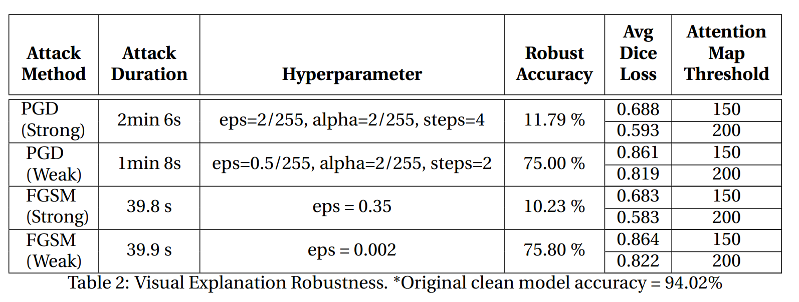

# Final Project: Re-evaluating PGD and FGSM Attacks & Extending Attacks to Visual Explanation Robustness
- COMS4995 Neural Networks & Deep Learning (Fall 2021, Prof. Richard Zemel)
- Coauthors: **Chaewon (Emily) Park**, Jinwoo Choi, Chungil Lee

The aim of this project is to implement two adversarial attacks (PGD, FGSM) on CIFAR-10 and re-evaluate each attack performance based on sensitivity analysis and per-class accuracy decomposition. In addition, we extend attacks to visual explanation and empirically show that visual explanation is robust to adversarial noise.

## Experiments

In this project, we perform three experiments. 
  - The first experiment is reevaluating the attack success rate of FGSM and PGD on CIFAR10. We fine-tune hyperparameters such as perturbation size, alpha (step size), and number of steps to observe how they impact the robustness accuracy and perform sensitivity analysis.

  - The second experiment extracts per-class robustness accuracy and observes how each attack method influences each of the ten classes differently.

  - The final experiment is a novel extension of the two attack methods to a new application, called Explainable AI, in order to evaluate the Visual Explanation Robustness of CNN models. Conventional attacks focused on producing adversarial examples that cause classifier’s mispredictions. For the Explainable AI application, we test how adversarial perturbations can impact the robustness and quality of visual explanation using GradCAM and list interesting findings. We use dice loss algorithm from Section 3 to quantitatively evaluate the attention map deviation.

## Results

### Sensitivity Analysis
- PGD Sensitivity Analysis

  
  

- FGSM Sensitivity Analysis

  

### Per-Class Accuracy Decomposition

  

### Visual Explanation Robustness

  
  

## Conclusion

In this project, we performed three experiments to re-evaluate PGD and FGSM attacks. In both attacks, the most sensitive parameter affecting the robust accuracy is ϵ. PGD attack has a linear relationship between the robustness accuracy and ϵ, while the performance of FGSM attack is more sensitive in smaller ϵs. Per-class accuracy for FGSM as ϵ increases provides us with some concerns regarding the method as the accuracy of one specific class increases from a lower ϵ to higher ϵ, while the accuracy of all other classes goes to near 0. Per-class accuracy for PGD from weak attack to strong attack decreases across all classes at a similar rate. For both attacks, the average dice loss and visual analysis of attention maps indicate that the visual explanation is robust. However, there exists a trade-off in using the two attacks as PGD takes much longer time to train and has more hyperparameters to tune, while FGSM is more simple, with only ϵ being the hyperparameter, but strong perturbations in FGSM are more apparent.
